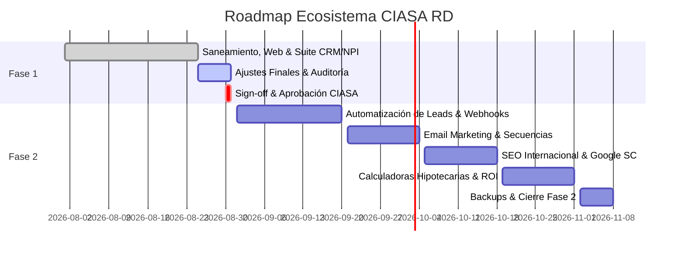

# PLAN MAESTRO VIVO — ECOSISTEMA DIGITAL CIASA RD
## Dirección Técnica, Arquitectura de Software y Gobernanza por Fases

---

### 1. Ficha del Proyecto
* **Cliente:** CIASA Bolsa Inmobiliaria RD
* **Directora Comercial & Ejecutiva:** Paola Caram Ibarra
* **Dirección Técnica & Desarrollo:** Rony Bello
* **Entorno de Producción:** Node.js Express (Clean URLs) + Hostinger Cloud / MySQL
* **Dominio Staging / Test:** `https://khaki-jay-690754.hostingersite.com`
* **Carpeta de Código Activo:** `c:\Users\Rony\Documents\GitHub\CIASARD-produccion`
* **Carpeta de Documentación:** `c:\Users\Rony\Documents\GitHub\CIASARD-documentacion`

---

### 2. Estado General del Roadmap

| Fase | Estado | Alcance Principal | Criterio de Pase |
| :--- | :---: | :--- | :--- |
| **Fase 1** | **95% (En Auditoría)** | Saneamiento web, Clean URLs, Suite CRM, Motor NPI, Video HTTP 206 | Validación de checklist + Firma formal de Paola Caram |
| **Fase 2** | **Planificada** | Automatizaciones Webhook, Email Marketing (Hostinger Reach/Mailchimp), SEO y Simulador BanReservas USD | Cierre formal de Fase 1 |
| **Fase 3** | **En Diseño** | Portal de Co-Brokers, Integración CRM Externa y App Móvil PWA | Culminación de Fase 2 |

---

### 3. Protocolo de Sincronización entre Documentación y Código
1. **Regla de Oro:** Ningún cambio sustancial pasa a producción sin registrarse en su respectivo Checklist de Fase.
2. **Ciclo de Entrega:**
   - Desarrollo y prueba local en `CIASARD-produccion` (`localhost:3000`).
   - Despliegue a Staging / Hostinger (`python scripts/deploy_hostinger.py`).
   - Ejecución de Auditoría Técnica Interna (`03_MATRIZ_AUDITORIA_INTERNA.md`).
   - Presentación de avances a Paola Caram.
   - Registro de conformidad y firma formal (`04_ACTA_ENTREGA_FIRMA_CIASA.md`).
