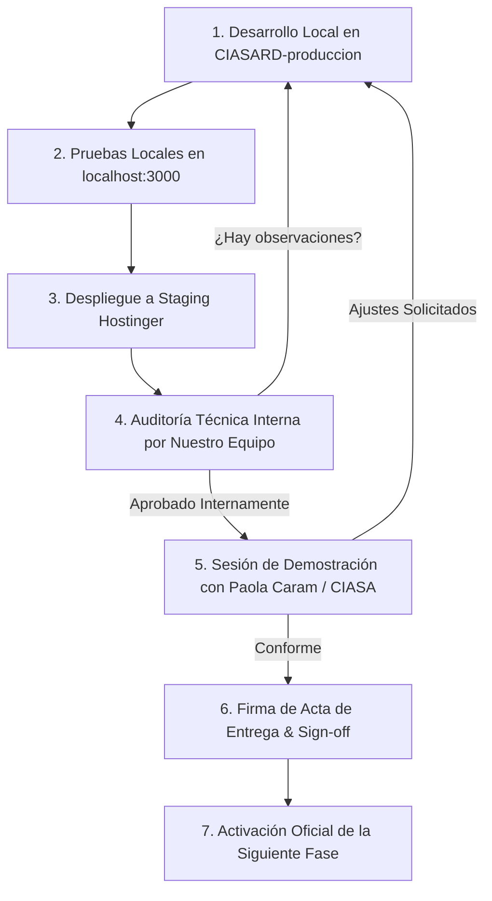

# PROTOCOLO DE AUDITORÍA Y APROBACIÓN DE ENTREGABLES
## Ecosistema Digital CIASA RD

---

### 1. Flujo de Trabajo y Pase de Etapas

---

### 2. Niveles de Validación Técnica
1. **Nivel 1 — Código y Servidor (Node.js / Express):**
   - Cero errores de sintaxis o dependencias faltantes.
   - Clean URLs canónicas sin extensiones `.html`.
   - Streaming HTTP 206 operativo para videos MP4.
   - Cabeceras de seguridad activas.
2. **Nivel 2 — Interfaz y Experiencia de Usuario (UI/UX):**
   - Adaptabilidad 100% responsiva (Móvil, Tablet, Desktop).
   - Sin emojis (solo iconos SVG y tipografía ejecutiva).
   - Formularios y botones de WhatsApp vinculados correctamente.
3. **Nivel 3 — Módulo Administrativo y CRM:**
   - Acceso seguro a `/admin/login`.
   - Creación y edición de propiedades, leads y artículos.
   - Exportación de prospectos NPI en lotes de 150 leads.
4. **Nivel 4 — Aprobación del Cliente:**
   - Verificación en vivo por parte de la Directora Comercial.
   - Firma del Acta de Entrega.
