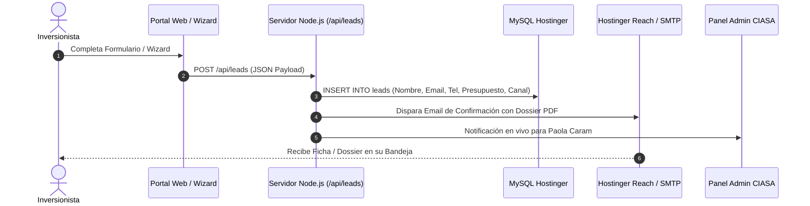

# FASE 2: ESPECIFICACIÓN TÉCNICA DE INTEGRACIONES
## Arquitectura de Webhooks, APIs y Conectores de Email

---

### 1. Flujo de Captura y Procesamiento de Leads

---

### 2. Endpoints Requeridos
* `POST /api/leads/capture`: Recepción de prospectos desde el portal y páginas de detalle.
* `POST /api/leads/wizard`: Recepción del perfil inversor con cálculo de retorno estimado.
* `GET /api/sitemap.xml`: Generación dinámica del mapa de sitio para Google Search Console.
